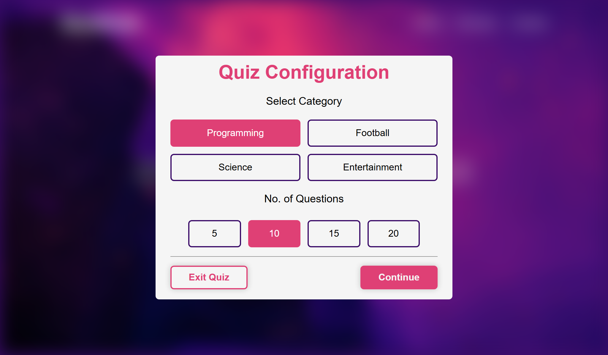

# QuizHub - Practice Project 🎯

This is a quiz application website created as part of my front-end development learning journey. The project was built to practice HTML, CSS, and JavaScript skills, focusing on interactive elements and responsive design.

 


## Project Purpose 🎓
- Practice implementing designs with code
- Improve JavaScript interactivity skills
- Master responsive layout techniques
- Learn DOM manipulation

## Key Features ✨
- **Category Selection**: Choose from Programming, Football, Science, or Entertainment quizzes
- **Customizable Length**: Select 5, 10, 15, or 20 questions
- **Real-time Scoring**: Instant feedback on answers
- **Results Display**: Animated circular progress chart
- **Fully Responsive**: Works on all device sizes

## Technical Implementation 💻
```plaintext
HTML5      - Structure and semantic markup
CSS3       - Flexbox, Grid, Animations, Transitions
JavaScript - Quiz logic, DOM manipulation, Event handling


## How to Explore 🔍
1. Clone the repository:
   ```bash
   git clone https://github.com/foidevans/QuizHub.git
   ```
2. Open `index.html` in any browser
3. Click "Start Quiz" and select your preferences
4. Test your knowledge!


## Learning Outcomes 📚
✔ DOM manipulation techniques  
✔ Event handling in JavaScript  
✔ CSS animations and transitions  
✔ Responsive design principles  
✔ Project organization skills  

## Credits
- **Developed**: Favour Evans.

---

**Note**: This is an educational project created for practice purposes. The design was used as a reference for learning front-end development concepts.
